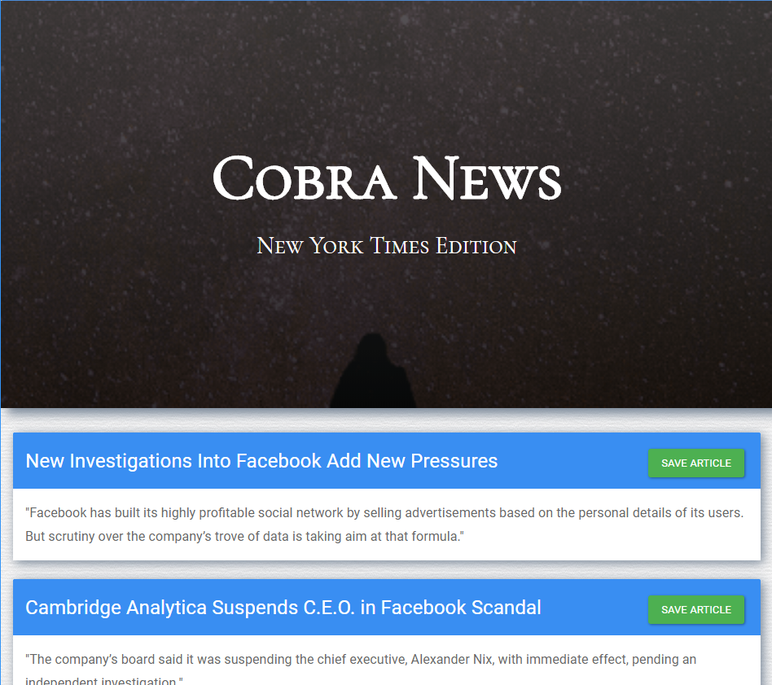

# CobraNews

CobraNews is a a small demonstration project to scrape a news site, collect articles, and allow a user to 'save' and annotate individual articles.

## Get Started

CobraNews is deployed on Heroku at: https://rocky-eyrie-47985.herokuapp.com/.  

## Installation       

To run locally for development purposes, clone down the repo, connect your mongdb server, run npm install, and then start server.js.  

### Prerequisites

CobraNews was built and tested with NodeJS v9.3.0, MongoDB 3.6.3, and the following NPM packages:

| NPM Package     | Version |
| --------------- | ------- |
| body-parser     | 1.18.2  |
| cheerio         | 1.0.0-rc.2 |
| express         | 4.16.3  |
| express-handlebars | 3.0.0 |
| mongoose | 5.0.10  |
| mongoose-type-url | 1.0.2 |
| request | 2.85.0 |

### Installing

1. Clone the repo to your system.

1. Run `npm install`

## Technologies

This service was built to demonstrate use of Mongoose, Express, Cheerio, and Handlebars.  

## Authors

* **Paul Rowe** - *Initial work* - [zrowe](https://github.com/zrowe)

## License

This project is licensed under the MIT License - see the [LICENSE.md](LICENSE.md) file for details

## Acknowledgments

* UC Berkeley Coding BootCamp
* Trilogy
* Many thanks to Amber Burroughs, Abraham Ferguson, and Dani Roxberry for their feedback, guidance, and review.
